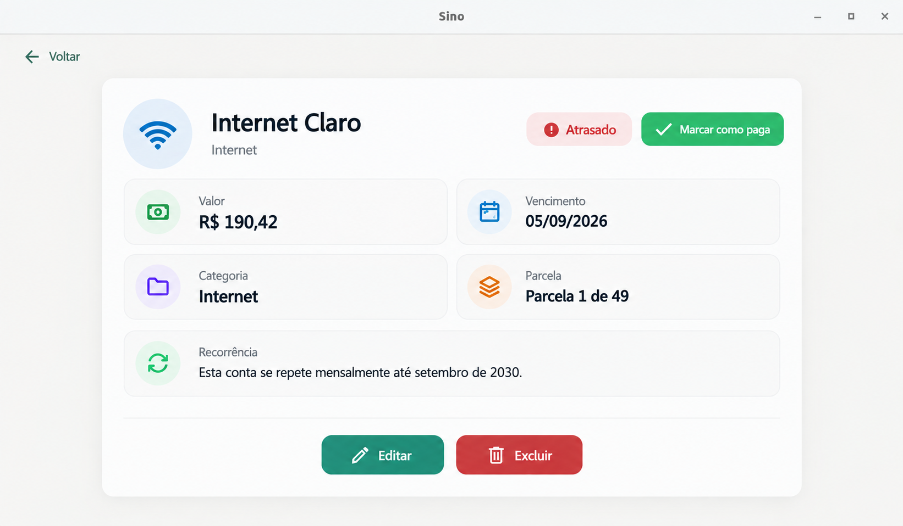
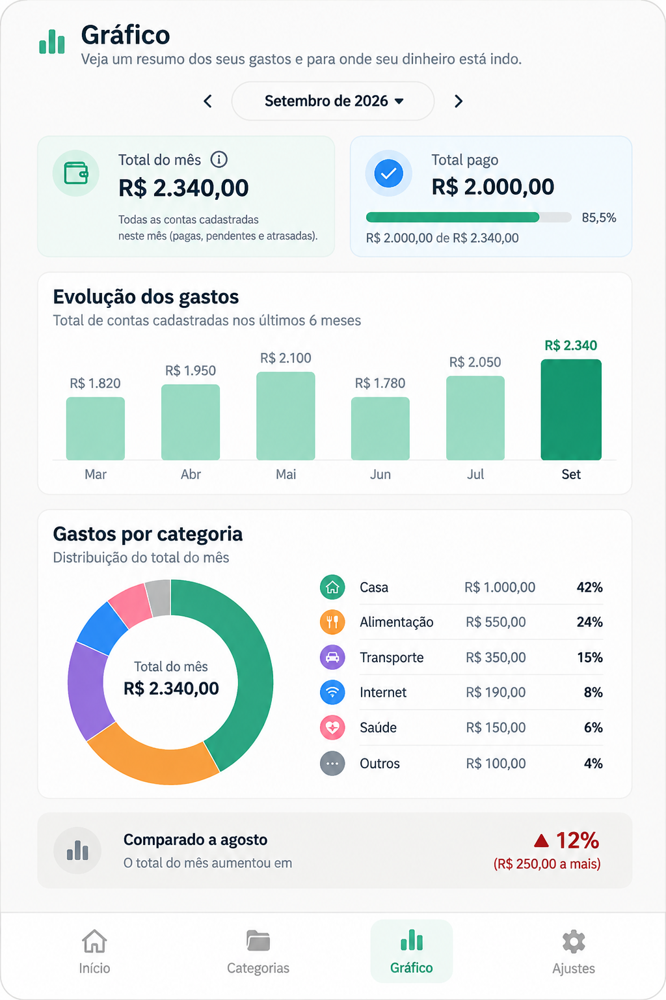
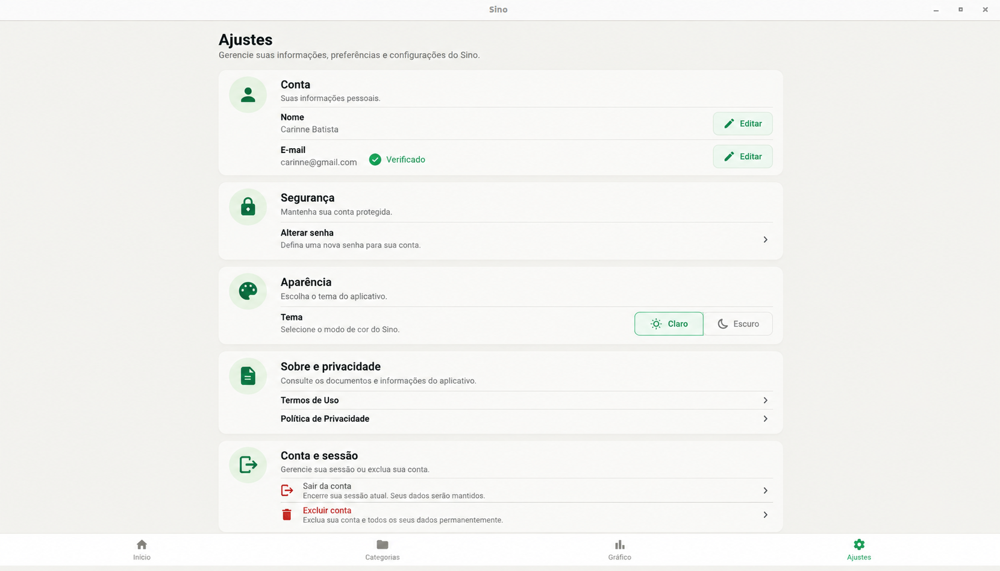

<p align="center">
  
</p>

# 🔔 Sino

**Controle de contas pessoais, simples e sem surpresas no fim do mês.**


O Sino é um aplicativo desktop para registrar e acompanhar as contas do dia a dia: aluguel, internet, faculdade, assinaturas e parcelas. Ele mostra o que vence, o que está em atraso e quanto do mês já foi pago, com os dados guardados localmente no seu computador.

É um projeto de portfólio, desenvolvido a partir de uma Especificação de Requisitos de Software (ERS) versionada, com as decisões de produto registradas a cada versão e testes automatizados.

## ✨ Funcionalidades

A versão atualmente implementada é a **v5.0**, descrita na [ERS v5.0](docs/ERS_Controle_de_Contas_v5.0.md).

- **Contas únicas, mensais ou anuais**, com ou sem data de término. Os vencimentos respeitam o calendário: uma conta do dia 31 vence em 28/02 e volta para 31/03.
- **Edição e exclusão com escopo**: em contas recorrentes, você escolhe entre "Somente este mês" e "Este mês em diante".
- **Recorrência flexível**: transforme uma conta avulsa em recorrente, altere a frequência ou encerre a recorrência sem perder o histórico.
- **Pagamentos** com data efetiva e status de atraso calculado automaticamente.
- **Visão do mês**: total do mês, contas que vencem nos próximos 7 dias e aviso de contas em atraso, com uma tela dedicada a elas.
- **Categorias** com emoji e cor própria: 11 prontas para usar e até 30 por usuário.
- **Parcelas**: cada ocorrência mostra sua posição na série, como "Parcela 3 de 12".
- **Contas de usuário** com aceite dos Termos de Uso e senhas armazenadas com PBKDF2.

## 🚧 v6.0

A v6.0 já está especificada na [ERS v6.0](docs/ERS_Controle_de_Contas_v6.0.md) e será a próxima etapa de evolução do projeto. Sua implementação funcional ainda não foi iniciada; até aqui foi feita apenas uma preparação técnica (testes de regressão, correção de um defeito da v5.0 e organização das cores da interface).

Entre as novidades especificadas estão:

- tela **Gráfico**, com evolução dos gastos, gastos por categoria e comparação com o período anterior;
- tela **Ajustes**, com nome, e-mail verificado, alteração de senha, tema claro/escuro e exclusão da conta;
- tela **Detalhes da conta** reformulada e descrição opcional nas contas;
- recuperação de senha por código enviado ao e-mail.

### Protótipos da v6.0

> [!NOTE]
> As imagens abaixo são **protótipos**. Elas mostram a direção visual da v6.0 e **ainda não representam funcionalidades implementadas** na versão atual do Sino.

<p align="center">
  
</p>

<p align="center">
  
  &nbsp;&nbsp;
  
</p>

## 🛠️ Tecnologias

- **Python 3.11**
- **[Flet](https://flet.dev) 0.86.5**, para a interface desktop
- **SQLite**, para o armazenamento local dos dados
- **unittest** (biblioteca padrão do Python), para os testes automatizados

## ▶️ Como executar

Pré-requisito: Python 3.11.

```bash
git clone https://github.com/carinne-batista11/sino.git
cd sino

python3 -m venv .venv
source .venv/bin/activate        # no Windows: .venv\Scripts\activate

pip install -r requirements.txt
python3 backend/main.py
```

Na primeira execução, o banco de dados é criado automaticamente em `database/sino.db`. Esse arquivo fica apenas na sua máquina e não é versionado.

## 🧪 Testes

```bash
python3 -m unittest discover tests
```

A suíte automatizada cobre a camada de dados: recorrência e geração de ocorrências, edição e exclusão com escopo, pagamentos, categorias e autenticação. Cada teste roda em um banco SQLite temporário e isolado, sem tocar nos dados reais do aplicativo.

## 📁 Estrutura

```
backend/    interface do aplicativo (Flet) e paleta de cores do tema
database/   camada de dados (SQLite)
docs/       especificações (ERS) e protótipos de interface
tests/      testes automatizados
```

## 📄 Documentação

- [ERS v6.0](docs/ERS_Controle_de_Contas_v6.0.md): próxima versão, especificada
- [ERS v5.0](docs/ERS_Controle_de_Contas_v5.0.md): versão implementada e auditada

Versões anteriores da ERS e os protótipos de interface estão em [`docs/`](docs/).

## 👩‍💻 Autora

**Carinne Batista**

O Sino é um projeto de portfólio, construído para praticar o ciclo completo de desenvolvimento de software: especificação de requisitos, modelagem de dados, implementação, testes e documentação.

## Licença

Distribuído sob a licença MIT. Veja o arquivo [`LICENSE`](LICENSE).
