<p align="center">
  
</p>

# 🔔 Sino

**Controle de contas pessoais, simples e sem surpresas no fim do mês.**


O Sino é um aplicativo desktop para registrar e acompanhar as contas do dia a dia: aluguel, internet, faculdade, assinaturas e parcelas. Ele mostra o que vence, o que está em atraso e quanto do mês já foi pago, com os dados guardados localmente no seu computador. A única comunicação do app com a internet é a confirmação de e-mail por código, descrita abaixo.

É um projeto de portfólio, desenvolvido a partir de uma Especificação de Requisitos de Software (ERS) versionada, com as decisões de produto registradas a cada versão e testes automatizados.

## ✨ Funcionalidades

A **v6.0**, descrita na [ERS v6.0](docs/ERS_Controle_de_Contas_v6.0.md), está **concluída para portfólio e demonstração local** (04/10/2026). As mudanças estão resumidas nas [notas da versão](docs/notas-da-versao.md). A **Sino 6.1** (06/10/2026), primeira entrega da [ERS v7.0](docs/ERS_Controle_de_Contas_v7.0.md), acrescenta versões e registro do aceite dos Termos de Uso e da Política de Privacidade.

- **Contas únicas, mensais ou anuais**, com ou sem data de término. Os vencimentos respeitam o calendário: uma conta do dia 31 vence em 28/02 e volta para 31/03.
- **Edição e exclusão com escopo**: em contas recorrentes, você escolhe entre "Somente este mês" e "Este mês em diante", inclusive para categoria e descrição.
- **Recorrência flexível**: transforme uma conta avulsa em recorrente, altere a frequência ou encerre a recorrência sem perder o histórico.
- **Pagamentos** com data efetiva e status de atraso calculado automaticamente.
- **Tela Principal** com o total do mês, todas as contas do mês, atalho para editar e aviso de contas em atraso; tela **"Ver status"** com filtros.
- **Detalhes da conta** com emoji e cor da categoria, status ao lado do pagamento e sempre os mesmos campos: valor, vencimento, categoria, parcela ("Parcela 3 de 12"), recorrência e descrição.
- **Gráfico** mensal e anual: total do período, total pago, evolução dos gastos, distribuição por categoria e comparação com o período anterior.
- **Categorias** com emoji e cor própria: 11 prontas para usar e até 30 por usuário.
- **Ajustes**: nome, e-mail, senha, tema **Claro ou Escuro**, Termos de Uso e Política de Privacidade, sair e **excluir a conta**.
- **Contas de usuário** com aceite dos Termos, senha mínima de 8 caracteres armazenada com PBKDF2 e confirmação do e-mail por **código** (cadastro, alteração de e-mail e "Esqueci minha senha").
- **Fechamento seguro**: fechar a janela enquanto um cadastro, uma alteração de e-mail ou uma recuperação de senha é gravado espera o fim da gravação.

## 📌 Situação da v6.0

**Concluído:** todas as funcionalidades acima, verificadas com 879 testes automáticos do aplicativo e 151 do serviço de códigos, além de validações manuais registradas na ERS (seções 13.3 a 13.6).

**Parcial:**

- A confirmação de e-mail por código funciona com o serviço de códigos ([`servidor/`](servidor/)) rodando **no próprio computador**. A integração com a Resend está implementada, mas a entrega real de e-mails não foi validada.
- Contraste dos dois temas medido nos testes em todas as telas, nos campos, nos gráficos de barras e nos estados principais. Ficam fora as fatias do gráfico de rosca nas cores das categorias (identificadas também pela legenda em texto), os controles desativados e o que o Flutter desenha por conta própria (calendário, dicas, foco).
- Desempenho com 1.000 contas [medido](docs/desempenho-v6.md): abaixo de 2 s por operação na consulta ao banco e na montagem das telas (máximo de 1,7 s no pior caso, com 1.000 contas no mesmo mês). A renderização da janela não foi medida.
- Termos de Uso e Política de Privacidade integrados ao app e aprovados pela autora para portfólio e demonstração local (04/10/2026); revisão jurídica pendente.

**Adiado para uso por outras pessoas:** publicação do serviço de códigos e envio real de e-mails (hospedagem, domínio, responsável pela operação), revisão jurídica dos Termos e da Política e decisão sobre versionamento do texto aceito. Por isso, o Sino é hoje um projeto de **portfólio e demonstração local**, não um aplicativo pronto para uso por terceiros.

## 📸 Telas

> [!NOTE]
> Capturas reais da v6.0, feitas no **modo de demonstração** (janela "Sino — Demonstração", banco próprio) com **dados fictícios** cadastrados pela própria interface. Legendas e origem em [`docs/capturas/`](docs/capturas/README.md).

**Início:** total do mês, avisos de vencimento e atraso e as contas do mês.

<p align="center">
  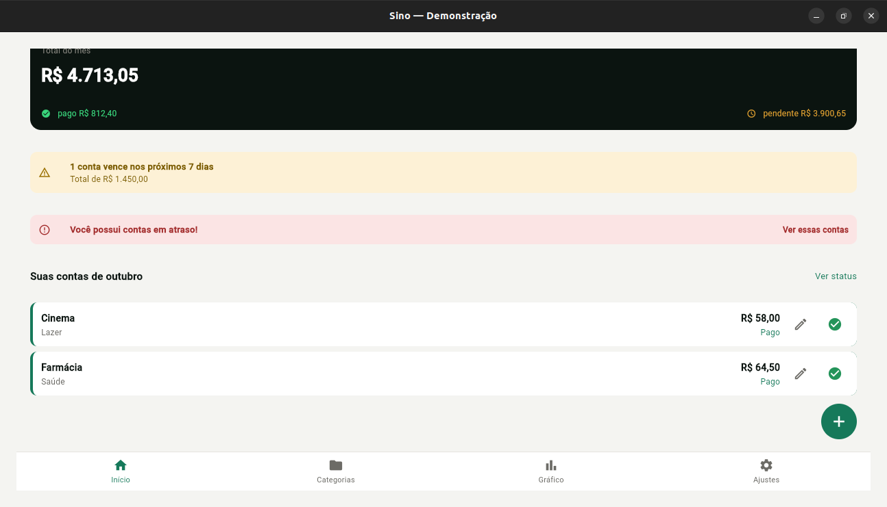
</p>

**Detalhes da conta:** valor, vencimento, categoria, parcela, recorrência e descrição; à direita, uma conta paga no tema Escuro.

<p align="center">
  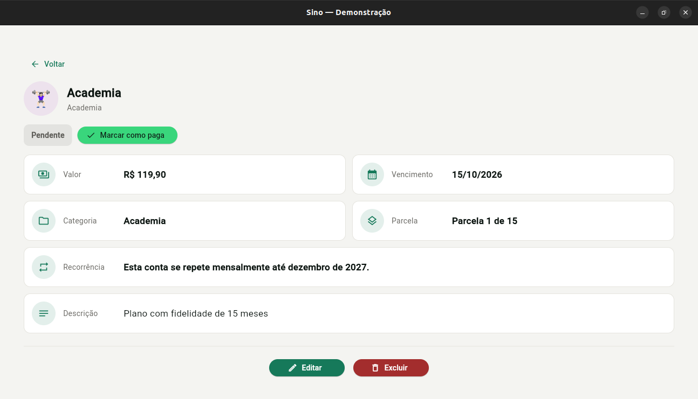
  &nbsp;
  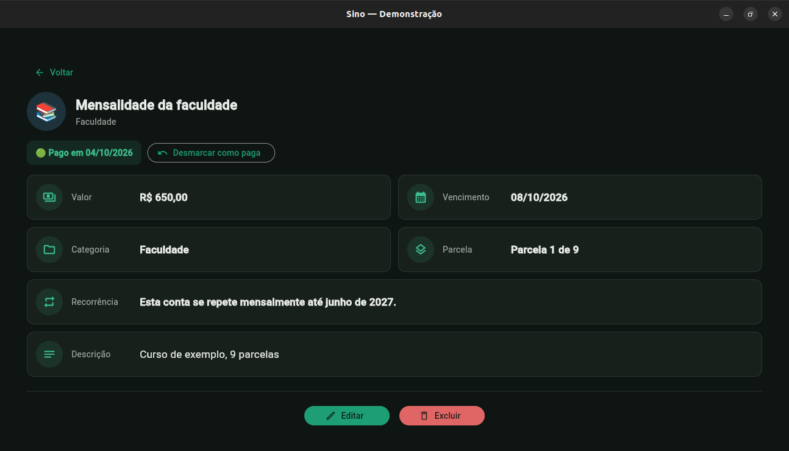
</p>

**Gráfico:** distribuição do mês por categoria, com legenda em texto.

<p align="center">
  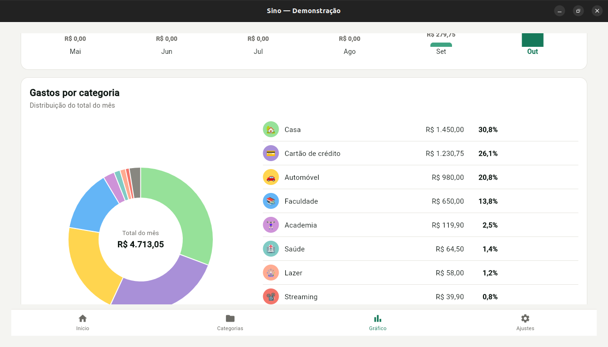
</p>

<details>
<summary><strong>Mais telas</strong>: Login, Categorias, Ver status, Ajustes, Gráfico anual e Início no tema Escuro</summary>

<br>

| | |
|---|---|
| 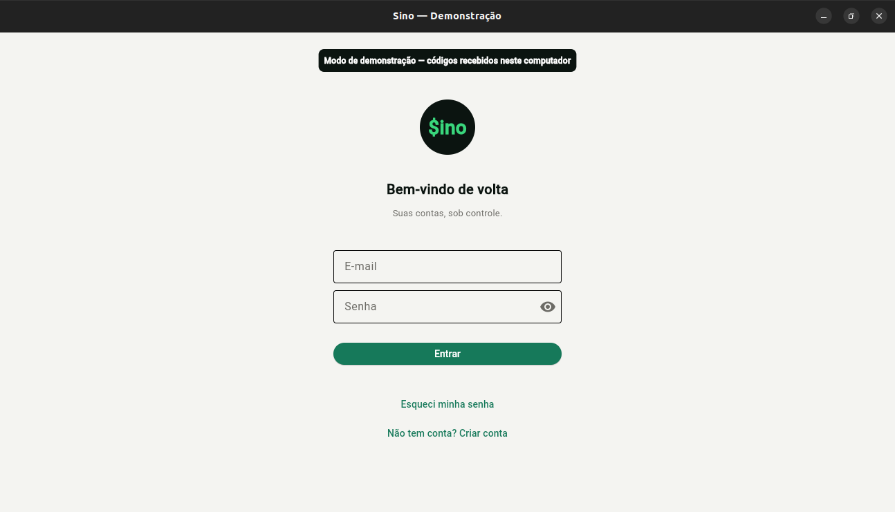<br>Login, com a faixa do modo de demonstração | 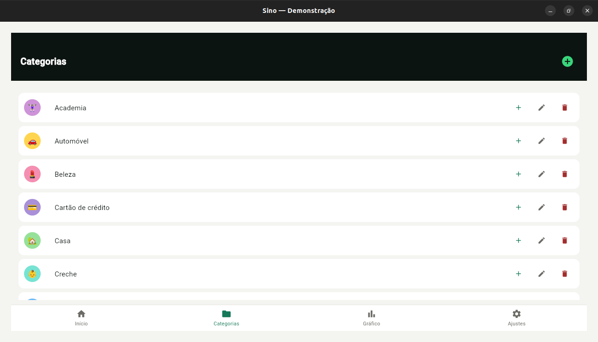<br>Categorias |
| 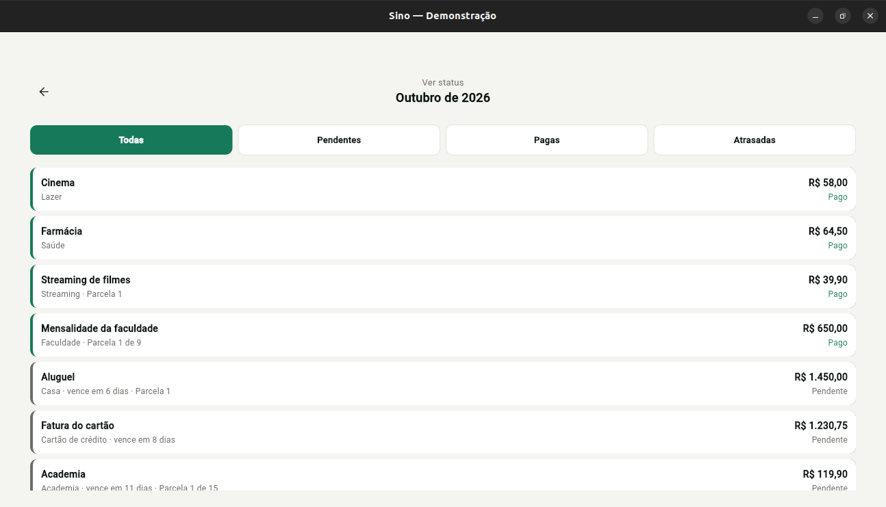<br>Ver status | 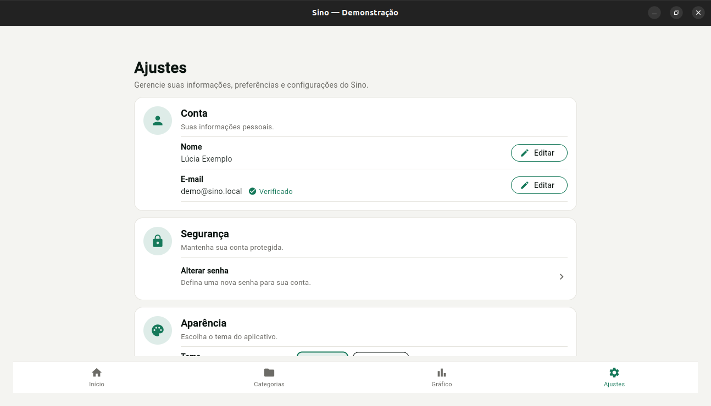<br>Ajustes |
| 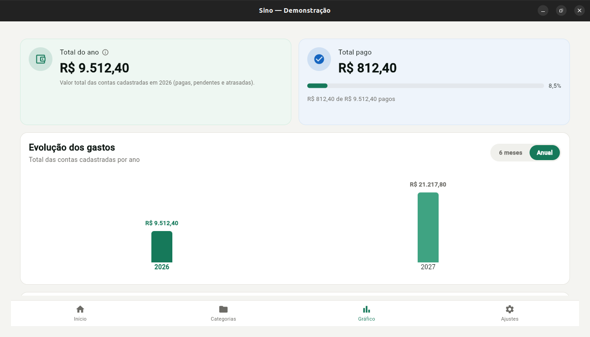<br>Gráfico anual | 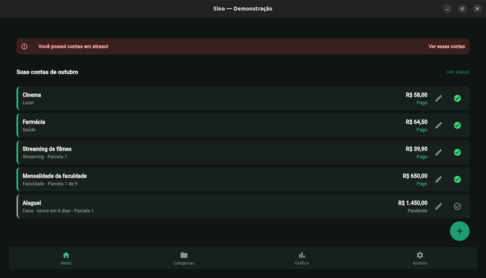<br>Início no tema Escuro |

</details>

<details>
<summary><strong>Protótipos da v6.0</strong> (histórico)</summary>

<br>

Protótipos feitos antes da implementação, mantidos como registro da direção visual da versão. As telas implementadas são as capturas acima.

<p align="center">
  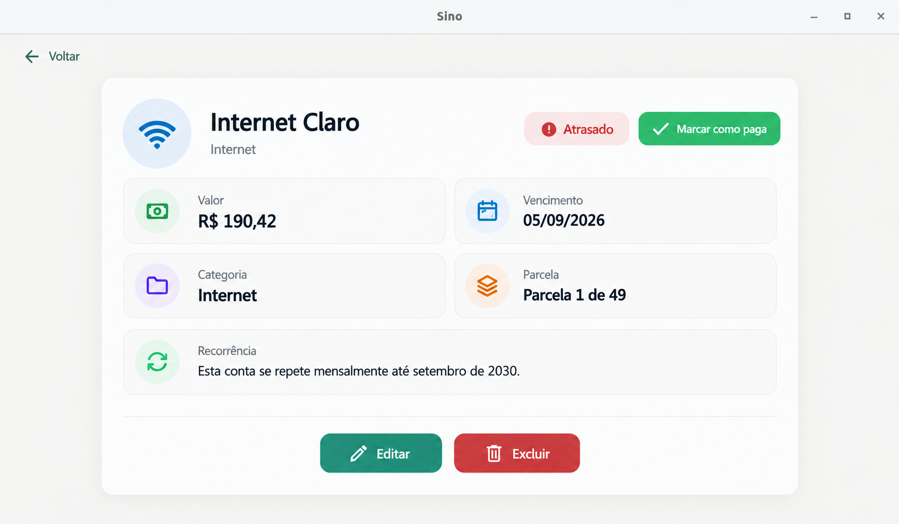
</p>

<p align="center">
  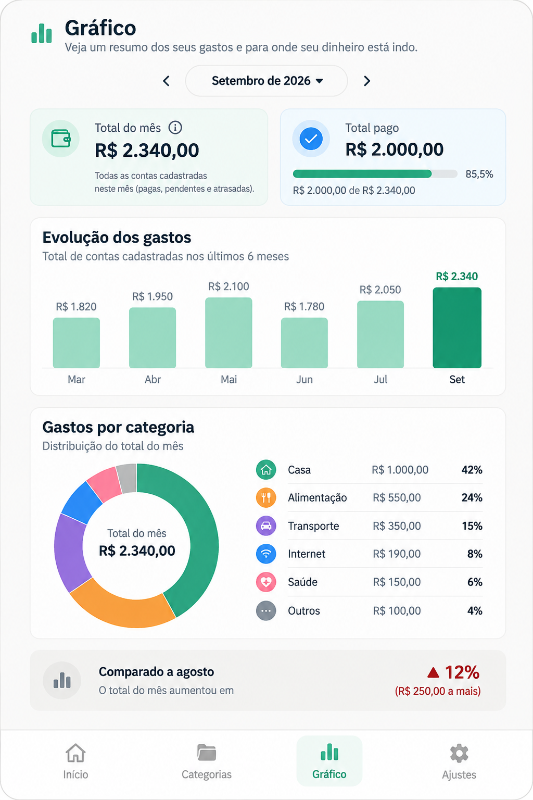
  &nbsp;&nbsp;
  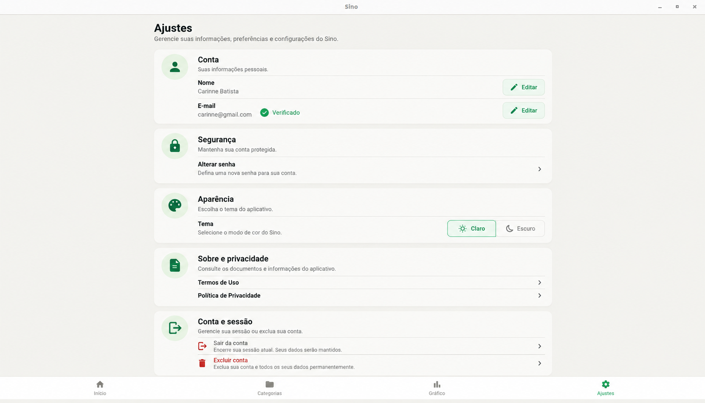
</p>

</details>

## 🛠️ Tecnologias

- **Python 3.11**
- **[Flet](https://flet.dev) 0.86.5**, para a interface desktop
- **SQLite**, para o armazenamento local dos dados
- **unittest** (biblioteca padrão do Python), para os testes automatizados
- **httpx** e **cryptography**, no cliente do serviço de códigos de e-mail
- **TypeScript**, **Cloudflare Workers** com **Durable Objects** (SQLite) e **Resend**, no serviço de códigos de e-mail, que roda localmente e ainda não foi publicado; testes com **Vitest**

## ▶️ Como executar

Pré-requisito: Python 3.11.

```bash
git clone https://github.com/carinne-batista11/sino.git
cd sino

python3 -m venv .venv
source .venv/bin/activate        # no Windows: .venv\Scripts\activate

pip install -r requirements.txt
python3 backend/main.py
```

Na primeira execução, o banco de dados é criado automaticamente em `database/sino.db`. Esse arquivo fica apenas na sua máquina e não é versionado.

Sem o serviço de códigos configurado, a tela de cadastro avisa que a confirmação por e-mail não está disponível e não cria a conta. O login de contas existentes funciona normalmente, sem internet.

### Demonstração local

Para experimentar o cadastro, a recuperação de senha e a alteração de e-mail sem enviar e-mails, use o [modo de demonstração](servidor/README.md#modo-de-demonstração-desenvolvimento) (precisa também do Node.js 24). Na raiz do projeto:

```bash
.venv/bin/python servidor/ferramentas/demonstracao.py ~/sino-demonstracao --node-bin <pasta do npx>
```

A janela se chama "Sino — Demonstração", usa um banco próprio (o banco real nunca é copiado) e os códigos chegam a uma caixa de mensagens neste computador. Isso **não comprova** acesso ao endereço de e-mail informado.

## 🧪 Testes

Com o ambiente virtual `.venv` ativado e as dependências instaladas (veja "Como executar"):

```bash
python3 -m unittest discover tests
```

A suíte (879 testes na entrega da v6.0) precisa do `.venv`: o cliente do serviço de códigos usa o `cryptography`, instalado pelo `requirements.txt`. Ela cobre a camada de dados (recorrência e geração de ocorrências, edição e exclusão com escopo, pagamentos, categorias e autenticação), as telas e o cliente do serviço de códigos. Cada teste de dados roda em um banco SQLite temporário e isolado, sem tocar nos dados reais do aplicativo. Nenhum teste acessa a rede externa; alguns usam conexões locais em `127.0.0.1` e os comandos `git`, `tar` e `ss` (Linux).

Os testes do serviço de códigos (`servidor/`, 151 testes) usam Node.js 24 e rodam localmente, sem conta em serviços externos:

```bash
cd servidor
npm ci
npm test
```

## 📁 Estrutura

```
backend/    interface do aplicativo (Flet), paleta de cores do tema e cliente do serviço de códigos
database/   camada de dados (SQLite)
docs/       especificações (ERS), notas da versão, contrato do serviço de códigos e protótipos de interface
servidor/   serviço de códigos de e-mail (roda localmente; não publicado)
tests/      testes automatizados do aplicativo
```

## 📄 Documentação

- [ERS v6.0](docs/ERS_Controle_de_Contas_v6.0.md): versão atual, concluída para portfólio e demonstração local (estado das Etapas 8 a 10 nas seções 13.3 a 13.5; encerramento e rastreabilidade dos testes na seção 13.6)
- [ERS v5.0](docs/ERS_Controle_de_Contas_v5.0.md): versão implementada e auditada
- [Notas da versão](docs/notas-da-versao.md)
- [Contrato do serviço de códigos](docs/contrato-servico-codigos.md)
- [Validação da Etapa 8](docs/validacao-etapa8.md): resumo das validações manuais, com ressalvas
- [Desempenho da v6.0](docs/desempenho-v6.md): ambiente, método e resultados da medição com 1.000 contas
- [Paleta das categorias](docs/paleta_sino.html): as 30 cores das categorias, com as 11 categorias criadas automaticamente. É uma página HTML: depois de clonar o repositório, abra o arquivo no navegador (por exemplo, `xdg-open docs/paleta_sino.html` no Linux); no GitHub, o link mostra só o código-fonte da página.

Versões anteriores da ERS e os protótipos de interface estão em [`docs/`](docs/).

## 👩‍💻 Autora

**Carinne Batista**

O Sino é um projeto de portfólio, construído para praticar o ciclo completo de desenvolvimento de software: especificação de requisitos, modelagem de dados, implementação, testes e documentação.

## Licença

O Sino é distribuído sob a **licença MIT com a condição "Commons Clause" v1.0**. O texto completo está no arquivo [`LICENSE`](LICENSE). **Não é uma licença open source:** o código-fonte está disponível, mas o direito de vender não é concedido.

Em resumo (o que vale é o texto do [`LICENSE`](LICENSE)):

* **Permitido:** usar, estudar, copiar, modificar e redistribuir, inclusive versões modificadas, mantendo os avisos de licença (com a Commons Clause).
* **Não concedido:** vender o Sino, ou seja, fornecer a terceiros, mediante pagamento ou outra contrapartida, um produto ou serviço cujo valor derive inteira ou substancialmente da funcionalidade do Sino. Cobranças por hospedagem, consultoria ou suporte relacionados ao Sino só entram nessa condição quando o valor do serviço deriva inteira ou substancialmente da funcionalidade do Sino; serviços que não se enquadram nisso não são afetados por ela. Para o que se enquadra, é preciso autorização da autora.
* **Alcance:** o código, os testes, as ferramentas e os documentos e imagens de autoria de Carinne Batista neste repositório. Bibliotecas, fontes, emojis e ícones de terceiros seguem as próprias licenças.
* **Versões anteriores:** até o commit `a8302c2`, inclusive, o repositório foi distribuído somente sob a licença MIT. Quem obteve essas versões mantém, sobre elas, as permissões da MIT.
